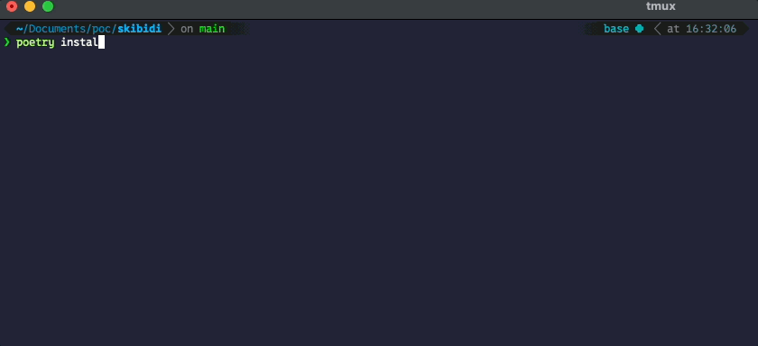

# skibidi

## Overview  
The **skibidi** Python library is a playful module inspired by the catchy and quirky Skibidi song. It offers a single, fun function `rizz()` that prints an amusing rendition of the Skibidi lyrics directly to your console. Perfect for injecting a bit of humor and light-heartedness into your Python projects or for a quick coding break.

## Installation  
Install skibidi easily with pip:

    pip install skibidi

Make sure to keep it updated to enjoy any new fun additions.

## Usage  
Once installed, importing and using `skibidi` is straightforward:

    import skibidi

    # Call the rizz function to print the Skibidi lyrics  
    skibidi.rizz()

Running this will output the whimsical lyrics, making your console a little more entertaining.

## Docker Usage
You can also run skibidi using Docker without installing Python or dependencies locally.
```bash
docker build -t desanterre/skibidi .
```
Run the container
```
docker run --rm desanterre/skibidi
````
This runs the rizz() function inside the container and outputs the lyrics directly in your terminal with formatting.

## Features  
- `rizz()` — Prints a unique, playful version of the Skibidi song lyrics to the console.

## Demo



## Why Use skibidi?  
- **Fun:** Brighten up your coding sessions with an unexpected musical interlude.  
- **Creative Logging:** Add quirky Easter eggs or creative logs to your projects.  
- **Lightweight:** Minimal dependency, easy to integrate anywhere.

## Contributing  
Contributions and suggestions are welcome! Whether you want to add more song variations, improve documentation, or suggest new features, feel free to open an issue or submit a pull request.

## License  
skibidi is licensed under the MIT License. See the LICENSE file for details.
